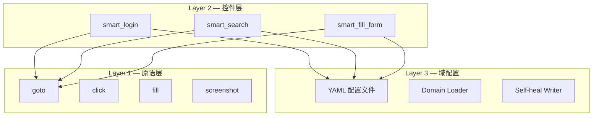

# ADR-001: 三层架构设计

## 状态

接受

## 上下文

在设计 Agentic Playwright MCP 时，我们需要一个清晰的架构来组织浏览器自动化代码。主要考虑因素：

1. **关注点分离**：不同层次的逻辑应该分开
2. **可测试性**：每一层都应该可以独立测试
3. **可扩展性**：容易添加新的站点适配器和交互模板
4. **AI 友好**：AI Agent 能够理解和生成代码

### 备选方案

**方案 A：扁平结构**

所有代码放在一个目录，按功能组织。

```
src/
├── actions.py
├── sites/
│   ├── baidu.py
│   └── github.py
└── templates/
    ├── login.py
    └── search.py
```

优点：简单直接
缺点：层次不清，难以复用

**方案 B：三层架构**

按抽象层次组织代码。

```
src/
├── layer_1/        # 原子操作
├── layer_2/        # 组合技能
└── layer_3/        # 域配置
```

优点：层次清晰，易于扩展
缺点：需要更多前期设计

**方案 C：插件架构**

每个站点是一个独立插件。

```
plugins/
├── baidu/
│   ├── __init__.py
│   ├── actions.py
│   └── config.yaml
└── github/
    ├── __init__.py
    ├── actions.py
    └── config.yaml
```

优点：完全解耦
缺点：过度工程化，增加复杂度

## 决策

采用**方案 B：三层架构**。

### 架构定义



#### Layer 1 — 原语层

**职责**：提供最基础的浏览器操作原子。

**特点**：
- 所有选择器通过参数传入，不硬编码
- 支持多个备选选择器（fallback chain）
- 每个操作都有超时控制
- 失败时抛出明确的异常

**示例**：
```python
async def click(selector: str, *fallbacks: str) -> None:
    """点击元素，支持多个备选选择器"""
    for sel in [selector, *fallbacks]:
        try:
            await page.click(sel, timeout=3000)
            return
        except:
            continue
    raise ElementNotFoundError(selector)
```

#### Layer 2 — 控件层

**职责**：组合原语，提供高级业务函数。

**特点**：
- 通过 `domain` 参数从 Layer 3 加载选择器
- 自动处理常见的 UI 模式
- 支持自定义选择器覆盖

**示例**：
```python
async def smart_login(domain: str, username: str, password: str, **kwargs):
    """智能登录，自动加载域配置"""
    config = load_domain(domain)
    await goto(config.base_url)
    await fill(config.locators.username, username)
    await fill(config.locators.password, password)
    await click(config.locators.submit)
    await wait_for_navigation()
```

#### Layer 3 — 域配置层

**职责**：管理站点特定的选择器配置。

**特点**：
- 每个元素提供多个备选选择器（CSS + XPath）
- 支持自愈写回：当选择器失效时，自动更新 YAML
- 使用 Pydantic 进行配置校验

**示例**：
```yaml
# domains/baidu.yaml
name: baidu
base_url: https://www.baidu.com
locators:
  search_input:
    css:
      - "#kw"
      - "input[name='wd']"
      - ".s_ipt"
    xpath:
      - "//input[@id='kw']"
```

### 层间依赖规则

| 层 | 可以调用 | 不能调用 |
|----|---------|---------|
| Layer 1 | Playwright API | Layer 2, Layer 3 |
| Layer 2 | Layer 1, Layer 3 | Playwright API |
| Layer 3 | 文件系统 | Layer 1, Layer 2 |

## 后果

### 正面影响

1. **关注点分离**：每一层职责清晰，易于理解和维护
2. **可测试性**：每一层可以独立测试，mock 依赖简单
3. **可扩展性**：添加新站点只需在 Layer 3 添加配置
4. **AI 友好**：AI 可以从 Layer 3 的配置和 Layer 2 的模板中学习

### 负面影响

1. **前期成本**：需要更多前期设计和抽象
2. **间接层**：简单的操作也需要经过多层调用
3. **学习曲线**：新成员需要理解分层概念

### 风险缓解

- 提供丰富的示例和文档
- Layer 1 保持简单，不引入不必要的抽象
- 允许在脚本中直接调用 Layer 1，绕过 Layer 2

## 相关决策

- [ADR-002: 沙箱脚本引擎](002-sandboxed-script-engine.md)
- [ADR-003: Agent 循环设计](003-agent-loop-design.md)
