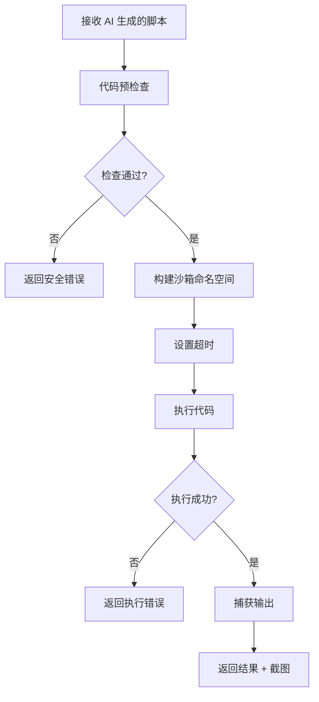

# ADR-002: 沙箱脚本引擎

## 状态

接受

## 上下文

Agentic Playwright MCP 的核心理念是让 AI 生成 Python 脚本来控制浏览器，而不是逐步调用工具。这带来一个关键问题：

**如何安全地执行 AI 生成的代码？**

### 安全风险

AI 生成的代码可能包含：

1. **恶意代码**：删除文件、访问敏感数据
2. **资源滥用**：无限循环、内存泄漏
3. **网络攻击**：访问内部网络、发送恶意请求
4. **系统破坏**：修改系统配置、安装软件

### 需求

1. **安全性**：防止 AI 代码破坏系统
2. **功能性**：提供足够的浏览器操作能力
3. **可调试性**：出错时能快速定位问题
4. **性能**：沙箱开销不能太大

### 备选方案

**方案 A：直接执行**

直接 `exec()` AI 生成的代码。

```python
exec(ai_generated_code)
```

优点：简单，无开销
缺点：极度不安全，不可接受

**方案 B：Docker 容器**

每个脚本在独立的 Docker 容器中执行。

```python
container = docker.containers.run("python:3.11", command=script)
```

优点：强隔离
缺点：启动慢（秒级），资源消耗大，Playwright 集成复杂

**方案 C：受限命名空间**

在受限的 Python 命名空间中执行代码。

```python
sandbox = {
    "goto": goto,
    "click": click,
    # ... 只暴露安全的函数
}
exec(code, {"__builtins__": {}}, sandbox)
```

优点：轻量级，易于集成
缺点：需要仔细管理白名单

**方案 E：WebAssembly**

在 WASM 沙箱中执行 Python 代码。

优点：强隔离
缺点：Python WASM 支持不成熟，性能差

## 决策

采用**方案 C：受限命名空间**，并辅以多层安全控制。

### 实现细节

#### 1. 受限命名空间

```python
# src/core/script_engine.py
class ScriptEngine:
    def __init__(self):
        self.sandbox = {
            # Layer 1 原语
            "goto": self._goto,
            "click": self._click,
            "fill": self._fill,
            "screenshot": self._screenshot,

            # Layer 2 控件
            "smart_login": self._smart_login,
            "smart_search": self._smart_search,
            "smart_fill_form": self._smart_fill_form,

            # 等待
            "wait": self._wait,
            "wait_for_navigation": self._wait_for_navigation,
            "wait_for_element": self._wait_for_element,

            # 页面信息
            "get_url": self._get_url,
            "get_title": self._get_title,
            "get_text": self._get_text,

            # 输出
            "print": self._print,
            "log": self._log,

            # 安全的内置函数
            "len": len,
            "str": str,
            "int": int,
            "float": float,
            "bool": bool,
            "list": list,
            "dict": dict,
            "tuple": tuple,
            "set": set,
            "range": range,
            "enumerate": enumerate,
            "zip": zip,
            "map": map,
            "filter": filter,
            "sorted": sorted,
            "reversed": reversed,
            "any": any,
            "all": all,
            "min": min,
            "max": max,
            "sum": sum,
            "abs": abs,
            "round": round,
            "isinstance": isinstance,
            "hasattr": hasattr,
            "getattr": getattr,
            "setattr": setattr,
            "type": type,
            "True": True,
            "False": False,
            "None": None,
        }
```

#### 2. 禁止危险操作

```python
# 禁止的内置函数和模块
BLOCKED = {
    "__import__", "exec", "eval", "compile",
    "open", "file", "input", "raw_input",
    "globals", "locals", "vars", "dir",
    "breakpoint", "exit", "quit",
    "help", "license", "credits",
}

# 禁止的模块
BLOCKED_MODULES = {
    "os", "sys", "subprocess", "shutil", "pathlib",
    "socket", "http", "urllib", "requests",
    "ctypes", "signal", "multiprocessing",
    "importlib", "pkgutil", "zipimport",
}
```

#### 3. 代码预检查

```python
def _validate_code(self, code: str) -> None:
    """在执行前检查代码安全性"""
    import ast

    tree = ast.parse(code)

    for node in ast.walk(tree):
        # 禁止 import 语句
        if isinstance(node, (ast.Import, ast.ImportFrom)):
            raise SecurityError("import 语句被禁止")

        # 禁止 exec/eval 调用
        if isinstance(node, ast.Call):
            if isinstance(node.func, ast.Name):
                if node.func.id in BLOCKED:
                    raise SecurityError(f"{node.func.id} 被禁止")

        # 禁止访问私有属性
        if isinstance(node, ast.Attribute):
            if node.attr.startswith("_"):
                raise SecurityError("禁止访问私有属性")
```

#### 4. 执行超时

```python
import signal

def _execute_with_timeout(self, code: str, timeout: int = 30):
    """带超时的代码执行"""
    def timeout_handler(signum, frame):
        raise TimeoutError(f"脚本执行超时 ({timeout}秒)")

    old_handler = signal.signal(signal.SIGALRM, timeout_handler)
    signal.alarm(timeout)

    try:
        exec(code, {"__builtins__": {}}, self.sandbox)
    finally:
        signal.alarm(0)
        signal.signal(signal.SIGALRM, old_handler)
```

#### 5. 输出捕获

```python
class OutputCapture:
    """捕获脚本输出"""
    def __init__(self):
        self.output = []
        self.logs = []

    def print(self, *args, **kwargs):
        self.output.append(" ".join(str(a) for a in args))

    def log(self, message: str):
        self.logs.append(message)
```

### 完整执行流程



## 后果

### 正面影响

1. **安全性**：多层防护防止恶意代码
2. **轻量级**：沙箱开销小（毫秒级）
3. **功能性**：提供丰富的浏览器操作 API
4. **可调试性**：清晰的错误信息和输出捕获

### 负面影响

1. **限制性**：某些合法操作可能被误杀
2. **绕过风险**：Python 的动态特性可能被利用绕过限制
3. **维护成本**：需要持续更新白名单和黑名单

### 风险缓解

1. **白名单优先**：默认禁止，只允许已知安全的操作
2. **AST 分析**：静态分析代码结构，而非仅检查字符串
3. **超时控制**：防止资源滥用
4. **日志记录**：记录所有执行的脚本，便于审计

## 安全建议

### 生产环境

1. 启用所有安全检查
2. 设置较短的超时时间（30 秒）
3. 记录所有脚本执行日志
4. 定期审查 AI 生成的脚本

### 开发环境

1. 可以放宽某些限制
2. 设置较长的超时时间（120 秒）
3. 启用详细日志

## 相关决策

- [ADR-001: 三层架构设计](001-three-layer-architecture.md)
- [ADR-003: Agent 循环设计](003-agent-loop-design.md)
