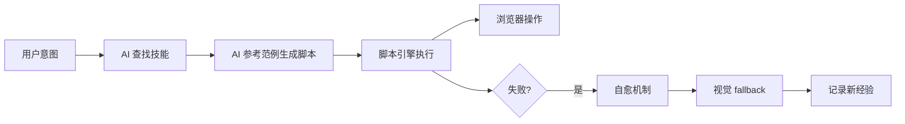
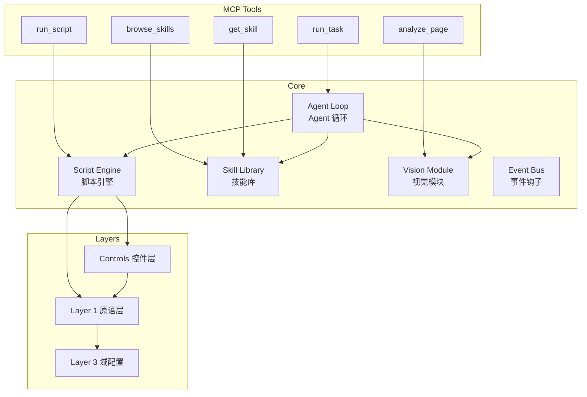

# Agentic Playwright MCP

让 AI Agent 写 Python 脚本来控制浏览器的 MCP Server。

基于 Playwright，支持可选的 [CloakBrowser](https://github.com/CloakHQ/CloakBrowser) 反检测引擎。

---

## 核心理念

**AI 不是逐个调用工具，而是编写 Python 脚本。**



## 架构概览



## 功能模块

| 模块 | 说明 | 状态 |
|------|------|------|
| **Agent 循环** | OBSERVE→PLAN→ACT 自主执行，自然语言驱动 | :material-check: |
| **脚本引擎** | 受限沙箱执行 AI 生成的 Python 脚本 | :material-check: |
| **控件层** | `smart_login`, `smart_search` 等 15 个高级函数 | :material-check: |
| **标准脚本库** | `.py` 范例 + `.md` 说明 + `skills.yaml` 索引 | :material-check: |
| **视觉模块** | 截图 + 多模态 LLM 理解页面 | :material-check: |
| **Layer 1 — 原语层** | `goto`, `click`, `fill`, `screenshot` | :material-check: |
| **Layer 3 — 域配置** | YAML 选择器 + 自愈写回 | :material-check: |
| **事件钩子** | EventBus + 7 种标准事件 | :material-check: |
| **插件系统** | SkillBase 抽象类 + skills.yaml 声明式配置 | :material-check: |
| **CLI** | `browser-agent serve/run/doctor` | :material-check: |

## MCP 工具列表

| 工具 | 说明 |
|------|------|
| `run_task` | 自然语言驱动的自主 Agent 循环 |
| `browse_skills` | 按关键词或 URL 查找技能库 |
| `get_skill` | 获取技能源码和说明文档 |
| `run_script` | 在受限沙箱中执行 Python 脚本 |
| `analyze_page` | 截图 + 多模态 LLM 分析页面 |
| `browser_launch` | 启动 Chromium 浏览器 |
| `screenshot` | 截取当前页面截图 |
| `ping` | 健康检查 |

## 快速开始

```bash
# 安装
pip install -e .
playwright install chromium

# 配置
cp .env.example .env

# 启动
browser-agent serve
```

详见 [快速开始指南](quickstart.md)。

## 文档导航

- [快速开始](quickstart.md) — 5 分钟上手
- [架构概览](architecture.md) — 系统分层设计
- [技能库](skills.md) — 如何创建自定义技能
- [API 参考](api.md) — MCP 工具文档
- [架构决策](adr/index.md) — 设计决策记录

## 示例

```bash
# 运行示例
python examples/01_basic_browser.py
python examples/02_script_engine.py
python examples/03_domain_automation.py
python examples/04_event_hooks.py
python examples/05_mcp_client.py
```

## 统计

| 指标 | 数值 |
|------|------|
| MCP 工具 | 8 个 |
| Python 源文件 | 22 个 |
| 测试用例 | 475 个 |
| 控件函数 | 15 个 |
| 站点适配器 | 2 个 |
| 通用模板 | 4 个 |
| 说明文档 | 6 份 |
